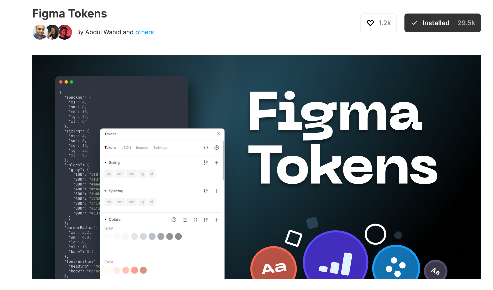
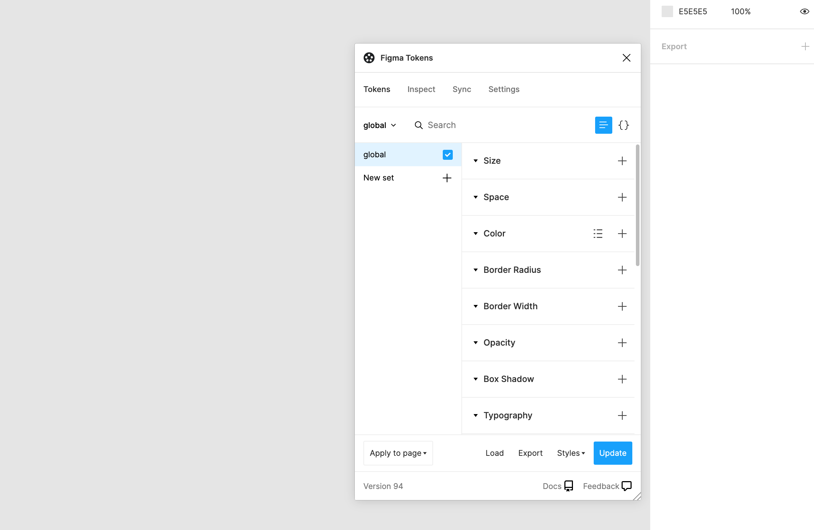
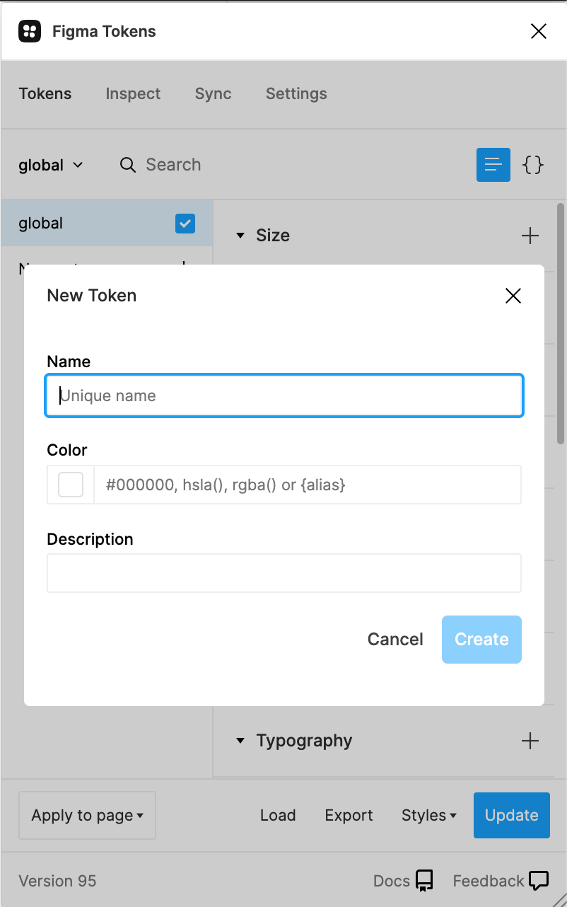
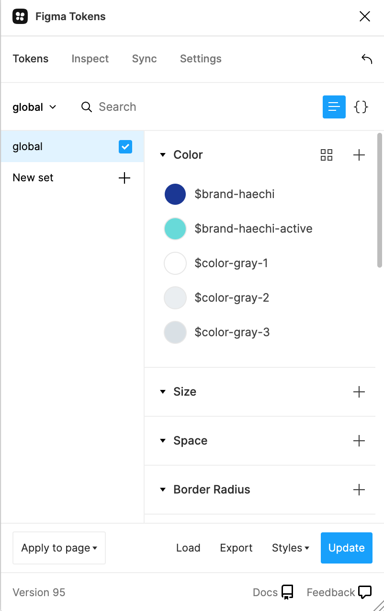
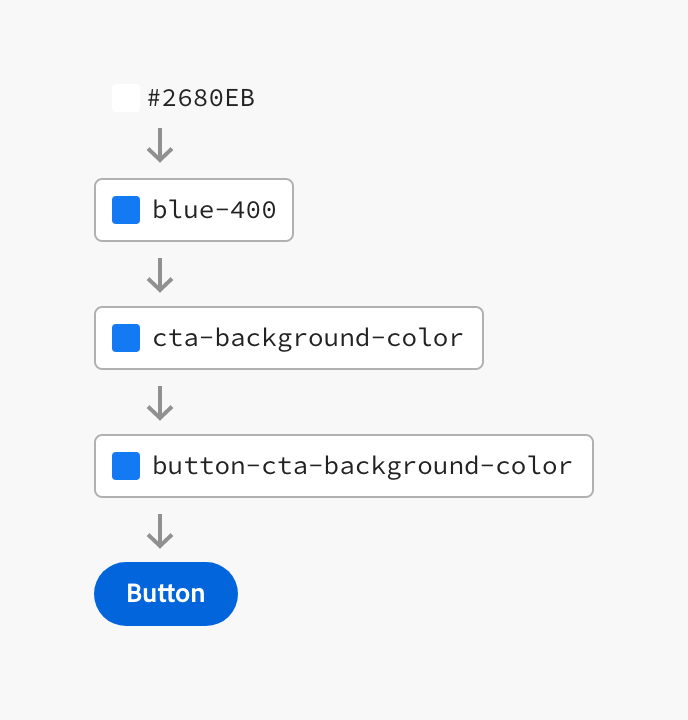
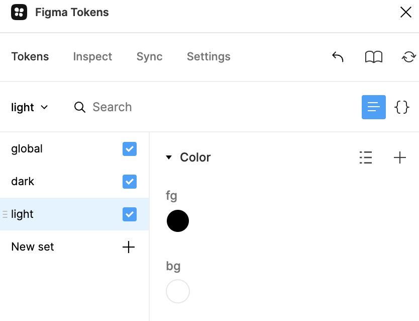
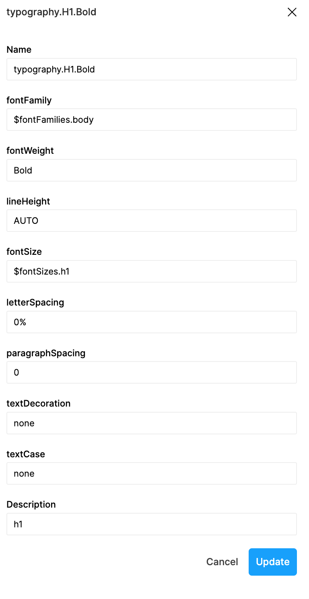

# Figma-Tokens

### 링크

[Figma Tokens: Plugin Docs](https://docs.tokens.studio/)

[Material Design](https://material.io/design/color/the-color-system.html#color-theme-creation)

[A Visual Type Scale](https://type-scale.com/)

[Build software better, together](https://github.com/settings/tokens/new)

[[A1] Do more, with less. - 디자인 시스템, 그다음은?](https://youtu.be/LmLchZ4tCXc)

## Design Tokens Research 이유

- 디자인 토큰 리서치의 목표는 효율적인 디자인 시스템 관리를 하기 위함
- 일관된 디자인 토큰 - 시스템으로 작업 시간 & 운영 공수 줄이기

## Design Token 개요

- 디자인 토큰은 디자인 시스템 작업 시 디자인 속성을 다양한 방법으로 저장하는 방법입니다.
- 디자인 토큰은 디자인 시스템의 시각적 원자, 특히 시각적 디자인 속성을 저장하는 실체로 정의합니다. 확장 가능하고 일관된 시각적 시스템을 유지하기 위해 하드 코딩된 값 대신 이 값을 사용합니다.

## Design Token 적용 방법

### 1. Figma Plugin

- Figma Tokens를 설치 합니다.
  
  
    

### 2. 각 속성별 Token을 만듭니다.

- Global 속성의 Token을 만든다.
- 각 Theme에 대한 Token은 새로운 Set을 만들어 진행한다.
  
  

- Available Tokens

|Group|Application|
|------|------|
|Sizing|width, height|
|Spacing|Auto-Layout (Gap, padding)|
|Color|Styles and Layers: Fill, border (right click)|
|Border radius|All corners, individual|
|Border width|Border width|
|Box Shadow|Styles and Layers: (one or many, drop/inner)|
|Opacity|Opacity|
|Font family|Text layers (in combination with weight)|
|Font weight|Text layers (in combination with family)|
|Font size|Text layers|
|Line height|Text layers|
|Letter spacing|Text layers|
|Paragraph spacing|Text layers|
|TextCase|Text layers|
|TextDecoration|Text layers|
|Typography compositions|Text layers, styles|


- 새로운 Theme의 Set을 만들면 사용하는 Token의 정확한 목적을 이름으로 정해야한다. [Adobe Spectrum link](https://spectrum.adobe.com/page/design-tokens/)
    - ex) button-cta-background-color
    - ex) button-cta-background-color-hover
    - ex) button-cta-background-color-focus
        
    
        
    

### 3. Theme Set을 만듭니다.

- Theme에 맞는 스타일을 Global에 있는 속성을 가져와서 만들 수 있습니다.
  

### 4. 만들어진 디자인 토큰으로 디자인 시스템을 작업합니다.

## Figma File

[https://www.figma.com/file/NYXodUamR9NbXyXQ5bSt1z/Design-Tokens?node-id=0%3A1](https://www.figma.com/file/NYXodUamR9NbXyXQ5bSt1z/Design-Tokens?node-id=0%3A1)

## PD <> FE 협업 포인트

- 디자인 토큰은 개발까지 이어졌을 때 의미가 큼
- 전달/적용 방법을 사전에 PD<>FE 사이에 정의를 잘 해야함
- Github으로 저장한 tokens.json
    
    [Figma-Tokens/tokens.json at main · dongdorong/Figma-Tokens](https://github.com/dongdorong/Figma-Tokens/blob/main/tokens.json)
    
- Github에 저장된 토큰을 개발 중에 사용하는 방법
    
    [Figma Tokens: Plugin Docs](https://docs.tokens.studio/sync/github)
    

## 주의 사항

- CSS 코드와 같아서 변수명이 다르면 디자인 토큰이 적용이 안되니 이름을 틀리지 않게 주의해야함


```json
"typography": {
    "H1": {
      "Bold": {
        "value": {
          "fontFamily": "$fontFamilies.body",
          "fontWeight": "Bold",
          "lineHeight": "AUTO",
          "fontSize": "$fontSizes.h1",
          "letterSpacing": "0%",
          "paragraphSpacing": "0",
          "textDecoration": "none",
          "textCase": "none"
        },
        "type": "typography",
        "description": "h1"
      }
	}
}
```

## 리서치와 PD <> FE 논의를 통해 알게된 점

- 정교한 Design system을 원한다면 도입해볼 수 있다고 생각이 든다.
- 초반 setting할때 방대한 Design token의 양으로 PD의 공수가 크게 든다. (한번 구축해놓으면 거의 변경 X)
- Figma에서 Design token을 json으로 뽑을 수 있어도 FE가 사용하려면 코드 변환 프로그램을 사용해야함으로 공수가 든다.
- Global적인 Token은 한번 등록해 놓으면 거의 건들지 않기 때문에 Design Token을 json으로 만들어서 관리하는 것이 의미가 없을 것 같다.
- Theme을 바꾸거나, App, Web의 font family, color 등 스타일이 다를 경우에는 token으로 관리하기가 더 수월할 것 같다.
- figma design library에는 spacing, border width, sizing 과 같은 디테일한 Token은 저장할 수 없기에 일관된 디자인 시스템을 만들기 위해서는 필요할 것 같다는 의견도 있었다.
- PD <> FE 간에 Token name 정책이 잘 세워져 있어야한다.
- PD는 Design system과 동시에 Design token도 관리해야해서 공수가 더 들 것 같다는 예상이다.